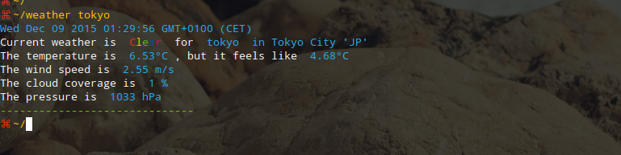

# weather

A nifty weather app in your terminal.



## Installation
- get a [free mapquest geocoding API key](https://developer.mapquest.com) and [forecast API key](https://developer.forecast.io/register)
- assign them to the `mapquest_key` && `forecast_key` variables in the `config.js` file.
- run ```$ npm install```

## Usage

- **`-l:`** Location to display forecast for. **Defaults to auto** location based off your ip address

- **`-d:`** Days of forecast to display

- **`-h:`** Hours of forecast to display

- **`-u:`** Unit system used. Defaults to **si**. options are **us, si, uk2, ca**. see forecast.io

- **`--ignore_alerts:`** Don't show alerts if any. **Defaults to false**

## Examples

```bash
# show current weather for your location based on your ip address
$ weather

# current weather for stockholm sweden
$ weather 'stockholm sweden'

# show current weather for stockholm without alerts and 4 days' forecast for stockholm
$ weather -l 'stockholm sweden' -d 4 --ignore_alerts

# current weather for your location plus forecast for the next 3 hours and 4 days
$ weather -d 4 -h 3 -u us
```

*pull requests very welcome!*
